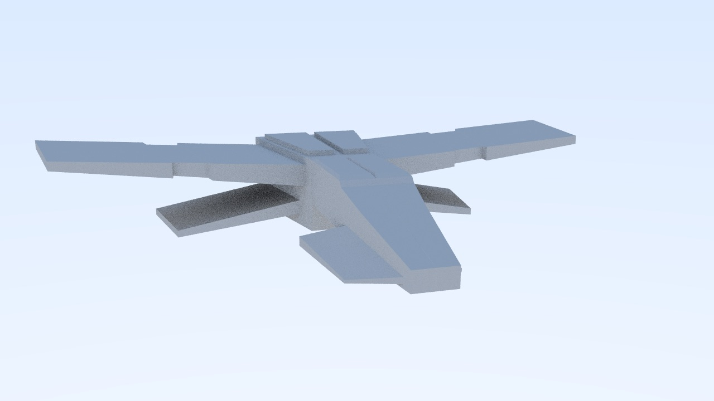
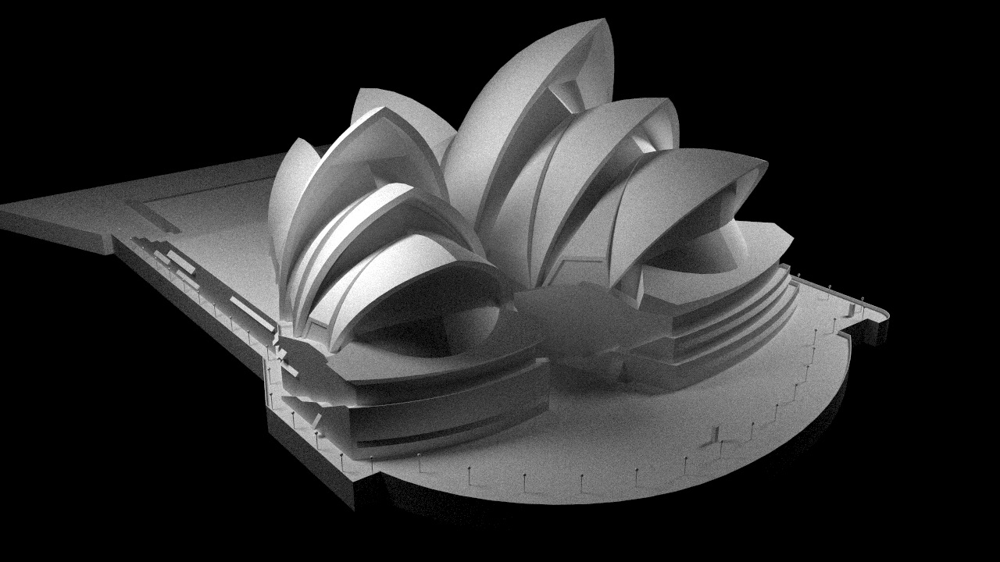

# Andromeda

  

使用C++编写的基于光线追踪（路径追踪）的软件渲染器。

## 特性

- 独立编译：C++ 11 标准库实现。
- 渲染输出：输出到PPM文件，可以用PhotoShop等图像软件打开。
- 坐标系标准：右手坐标系。
- 内置材质：漫反射，玻璃和金属材质。
- 内置模型：内置球体，正方体。
- 模型加载：支持obj格式模型加载。
- 纹理支持：支持jpg和png格式的图片作为纹理。
- 搜索优化：包围层次盒(BVH)。
- 光源：区域光源。
- 天空盒：六面天空盒。
- 性能优化：支持多线程。

## 使用方法

以下方法选择一种：

* `cmake`构建: `source`目录下包含`CMakeLists.txt`文件，直接使用即可。
* `g++`编译: `g++ main.cpp -o raytracing -std=c++11 -O3 -pthread`

## 演示

天空盒子

混合场景1

混合场景2

obj模型文件加载1

obj模型文件加载2

