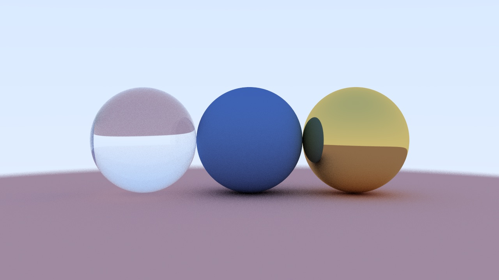
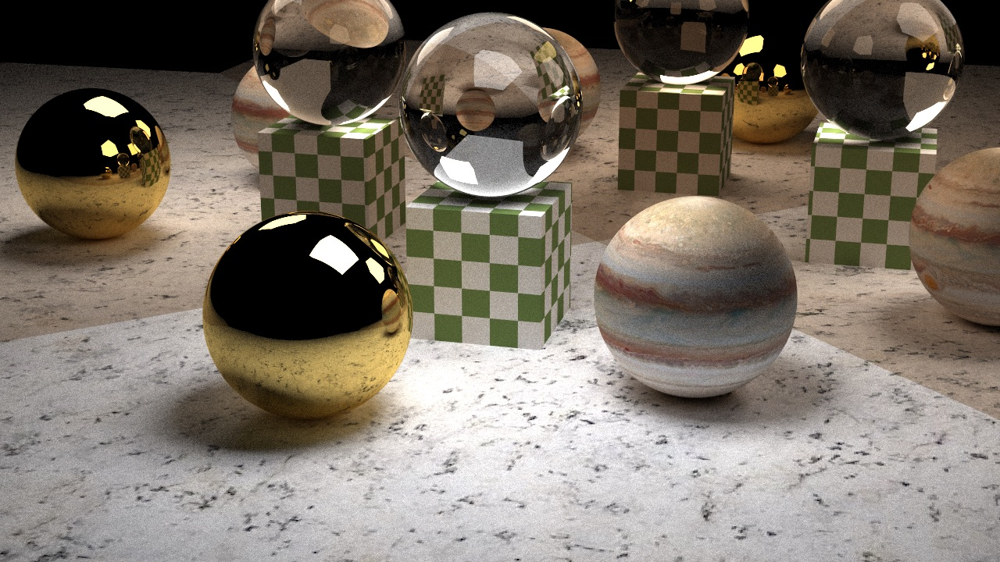

# 光线追踪渲染器

### 简介

使用C++编写的光线追踪渲染器。

### 特性

- 不依赖外部库，只需一个C++编译器。
- 渲染图像输出到PPM文件中。
- 实现了反射和折射的计算。
- 实现了漫反射，玻璃和金属材质。

### 使用方法

1. 将仓库克隆到本地。
2. 打开终端，进入工程目录。
3. 输入`cmake ./`生成makefile.
4. 输入`make`，在当前目录下得到程序`RayTracing`.
5. 运行`RayTracing`.

### 渲染图

